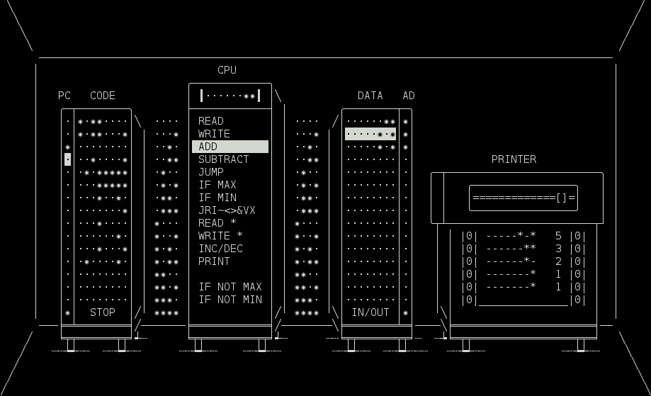

Comp Mark II
============

Updated version of [**Comp**](https://github.com/gto76/comp-cpp) – Simple 4-bit/1 Hz virtual computer for learning purposes



How to run on…
--------------

### Windows

* Install *Tiny Core Linux* on *VirtualBox* using this [**instructions**](https://github.com/gto76/my-linux-setup/tree/gh-pages/conf-files/tiny-core-linux).
* Run the *UNIX* commands.

### UNIX
```bash
git clone https://github.com/gto76/comp-m2.git
cd comp-m2
./run
```

Keys
----
* `space`, `f` - switch bit under cursor
* `tab` - switch address space
* `enter` - start/pause execution
* `esc` - cancel execution
* `d` - delete word under cursor
* `j` - move word up
* `k` - move word down
* `s` - save ram in textfile named `saved-ram-<num>`. To load it, start program with `./comp <file>`

Overview
--------

* Processor has one 8 bit register.
* Ram is separated into two address spaces; one for instructions, called CODE, and one for data, called DATA.
* All instructions are 8 bits long.
* Execution starts at the first address (0) of CODE ram.
* Execution stops when program reaches last address (15) of CODE ram.
* Most of instructions consist of instruction code and address:
```
instruction code - 4 bits
  |  +-- address - 4 bits
  v  v
----***-  ->  READ 14  ->  Copy value stored at address 14 of "DATA" ram to register.
```
* All addresses specified by instructions refer to DATA ram, except for addresses of "Execution Control" instructions (JUMP, IF MAX, IF MIN...). They refer to CODE part of ram.
* Some instructions (logic, READ REG, JUMP REG) do not specify address. They operate on register (SHIFT L/R, NOT, ...) or between register and first address of DATA ram (AND, OR, ...)
* Whatever gets written to the last address is sent to the printer, or to 'stdout' if program is running in non-interactive mode.
* When reading from the last address (15), we get a random byte value, or a single word from 'stdin' if program is running in non-interactive mode.

Instruction set
---------------
Most of the instructions, together with the highlighted region of the ram that they use/modify, are pretty self-explainatory. Exception are instructions, that start with `-***`, and are a part of **JRI~<>^VX** instruction cluster. They are:  
 * JUMP_REG,
 * READ_REG,
 * INIT,
 * NOT,
 * SHIFT_L,
 * SHIFT_R,
 * AND,
 * OR and
 * XOR.

Detailed descriptions of all instructions can be found [**here**](doc/instruction-set.md).

Non-interactive mode
--------------------
Non-interactive mode is started if any input is piped to the program. In this mode:  
* computer prints to 'stdout',
* there is no user interface,
* there is no pause between cycles,
* and when program reads from last address, it gets one word from 'stdin' (pipe). In this word every '`*`' is interpreted as true and all other characters as false. If word starts with a digit, then it is red as a number and converted appropriately.

Examples
--------
* Multiplication:
```
$ echo "3 4" | ./comp examples/multiply
----**--  12
```

* Moving single bit with 'a' and 'd' keys:
```
$ examples/keyFilter | ./comp examples/randomDot
----*---   8
-----*--   4
----*---   8
---*----  16
```
